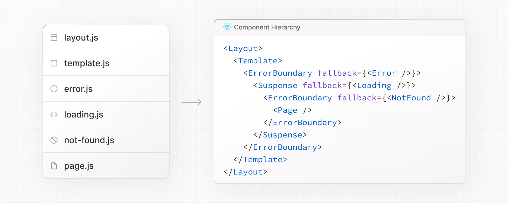

# NextJS Guide

## App Router

nextjs use `app router` for routing,
it follows **directory hierarchy**
and requires below files in directory to enable routing:

- `page.tsx`, page component
- `route.tsx`, API endpoint

```bash
# directory hierarchy example for routing
app                         --> /
  |-- items                 --> /items
        |-- [<item-id>]     --> /items/<item-id>
```

get path variables from dynamic routing `[<item-id>]` by `params` parameters and `params` could by customized by `function generateStaticParams({ params })`, details please refer to [generateStaticParams](https://nextjs.org/docs/app/api-reference/functions/generate-static-params).

### Route files



### Navigation

- use `<Link>` component
- use `useRouter` hook

## Component

Component is `Server Component` by default.

### Pure Server Component

- use `async/await`
  - **async** Page
  - **await** data from API/db

```tsx
export default async function Page() {
  // get from API
//   const data = await fetch('https://api.vercel.app/blog')
//   const allPosts = await data.json()
  
  // get from DB
  const allPosts = await db.select().from(posts)
  return (
    <ul>
      {allPosts.map((post) => (
        <li key={post.id}>{post.title}</li>
      ))}
    </ul>
  )
}
```

### Client Component

- require `'use client'` at top of component file
- not async Page
- get data from client state, such like `useState`, `RTK` and so on.

```tsx
'use client'

export default function Page() {
  const { data, error, isLoading } = useQueryByRTK()
 
  if (isLoading) return <div>Loading...</div>
  if (error) return <div>Error: {error.message}</div>
 
  return (
    <ul>
      {data.map((post: { id: string; title: string }) => (
        <li key={post.id}>{post.title}</li>
      ))}
    </ul>
  )
}
```

### Mixture for Server Component with Client Component

- use React's `use` hook to **stream data** with `Promise` from the server to client in Client Component.
- use streaming to break up the page's HTML into smaller chunks and send those chunks from the server to the client.
- wrap Client component with loading component
  - use `loading.tsx` file in route directory
  - wrap with `Suspense` by manual

```tsx
// Server Component part
import Posts from '@/app/ui/posts
import { Suspense } from 'react'
 
export default function Page() {
  // Don't await the data fetching function
  const posts = getPosts()
 
  return (
    <Suspense fallback={<div>Loading...</div>}>
      <Posts posts={posts} />
    </Suspense>
  )
}
```

```tsx
// Client Component part
'use client'
import { use } from 'react'
 
export default function Posts({
  posts,
}: {
  posts: Promise<{ id: string; title: string }[]>
}) {
  const allPosts = use(posts)
 
  return (
    <ul>
      {allPosts.map((post) => (
        <li key={post.id}>{post.title}</li>
      ))}
    </ul>
  )
}
```

## Server Render Features

### Server Function

- place `use server` directive at the top of an asynchronous function

```ts
export async function createPost(formData: FormData) {
  'use server'
  const title = formData.get('title')
  const content = formData.get('content')
 
  // Update data
  // Revalidate cache
}
```

#### invoke a Server Function

- **Forms** in Server and Client Components
- **Event Handlers** in Client Components

```tsx
import { createPost } from '@/app/actions'
 
export function Form() {
  return (
    <form action={createPost}>
      <input type="text" name="title" />
      <input type="text" name="content" />
      <button type="submit">Create</button>
    </form>
  )
}
```

```tsx
'use client'
 
import { useActionState } from 'react'
import { createPost } from '@/app/actions'
import { LoadingSpinner } from '@/app/ui/loading-spinner'
 
export function Button() {
  const [response, action, pending] = useActionState(createPost, false)
 
  return (
    <button onClick={async () => action()}>
      {pending ? <LoadingSpinner /> : 'Create Post'}
    </button>
  )
}
```

use `useActionState` to get more status of server function invokation.

### Error Handler In Server

- define a **fixed Error Response** and return it when **expected** error is raised.
- **Error Boundary** in `error.tsx` file in route directory to handle **uncaught** exceptions,
it only exists for client component.

## Reference

- [NextJS Document](https://nextjs.org/docs)