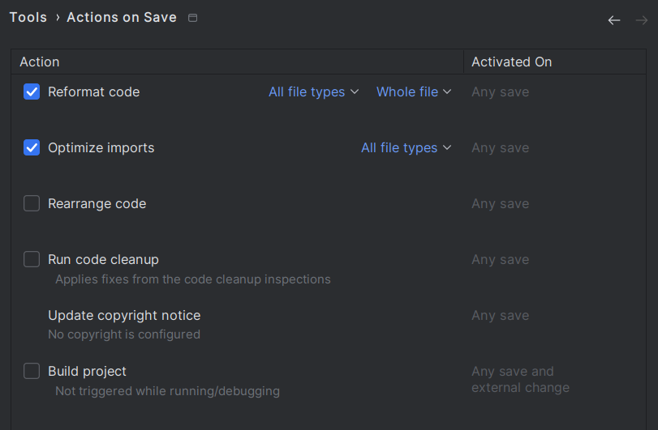
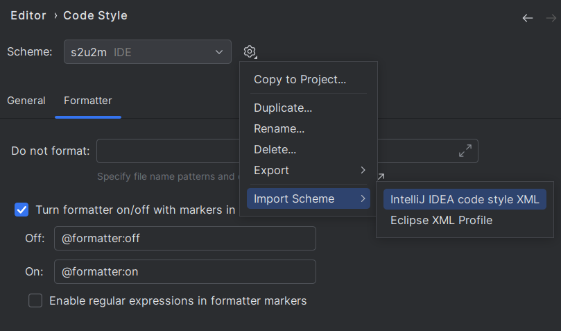
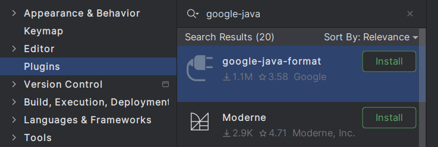

# 代码自动格式化的配置

## Java

### idea

```
idea: 2024.2.1
```

1. 打开Settings -> Tools -> Actions on Save
2. 勾选 Reformat code 和 Optimize imports



3. 下载[intellij-java-google-style](https://github.com/google/styleguide/blob/gh-pages/intellij-java-google-style.xml)
4. 导入intellij-java-google-style.xml



5. [可选，推荐] 安装google-java-format plugin



Reference:

- [IDEA设置保存时自动格式化代码自动导包](https://www.cnblogs.com/18sui/p/17267657.html)
- [如何套用 Google Java Style Guide 在不同的 Java 開發工具之間](https://blog.miniasp.com/post/2022/09/03/Google-Java-Style-Guide-for-Eclipse-STS4-and-IntellJ-IDEA)
- [如何使用 Google Java Format 做到更決斷的 Java 原始碼編排風格](https://blog.miniasp.com/post/2022/09/05/Using-google-java-format-on-VSCode-and-IntelliJ-IDEA)
- [google-java-format](https://github.com/google/google-java-format/blob/master/README.md#intellij-jre-config)


## JS/TS

### vscode

使用ESLint主要做代码检查，用Prettier来格式化代码

1. 安装ESLint和Prettier插件
2. 在settings.json文件中进行配置

```json
// settings.json
{
    "editor.formatOnSave": true,
    "editor.defaultFormatter": "esbenp.prettier-vscode",
    "prettier.requireConfig": true,
    "eslint.enable": true,
    "editor.codeActionsOnSave": {
       "source.fixAll.eslint": true
     }
}
```

3. 在项目中安装eslint和prettier, 由于ESLint和Prettier重叠的格式化规则会有冲突，
通过配置在ESLint使用prettier来进行格式化，
这需要额外安装依赖：eslint-config-prettier和eslint-plugin-prettier

```bash
$ npm install eslint prettier \
eslint-config-prettier eslint-plugin-prettier \
--save-dev
```

```json
// settings.json
{
  ...
  "[javascript]": {
    "editor.formatOnSave": false
  },
  "[javascriptreact]": {
    "editor.formatOnSave": false
  },
  "[typescript]": {
    "editor.formatOnSave": false
  },
  "[typescriptreact]": {
    "editor.formatOnSave": false
  },
  ...
}

```

4. 在 **.eslintrc.json** 中配置eslint的规则

Reference:

- [彻底搞懂ESLint与Prettier在vscode中的代码自动格式化](https://juejin.cn/post/7156893291726782500)
- [ESlint + Stylelint + VSCode自动格式化代码](https://github.com/woai3c/Front-end-articles/blob/master/eslint-vscode-format.md)

